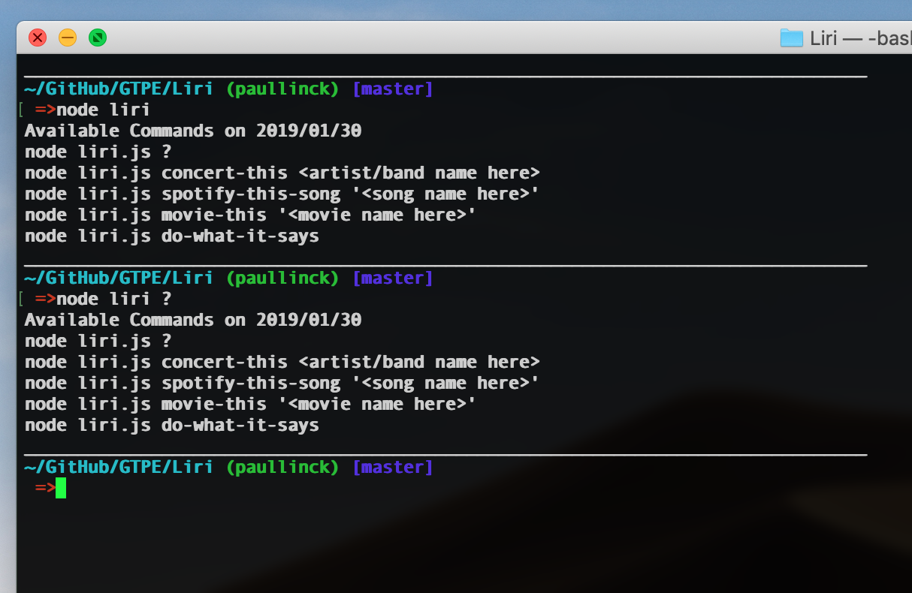
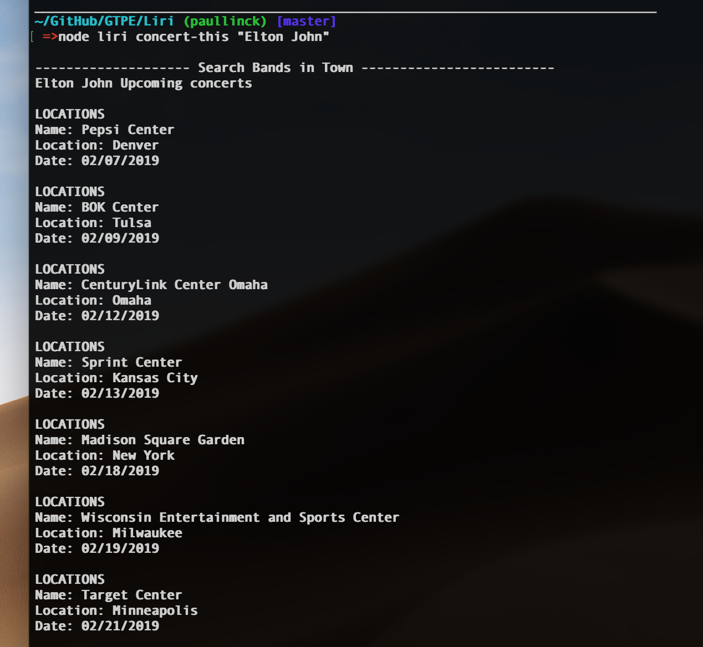
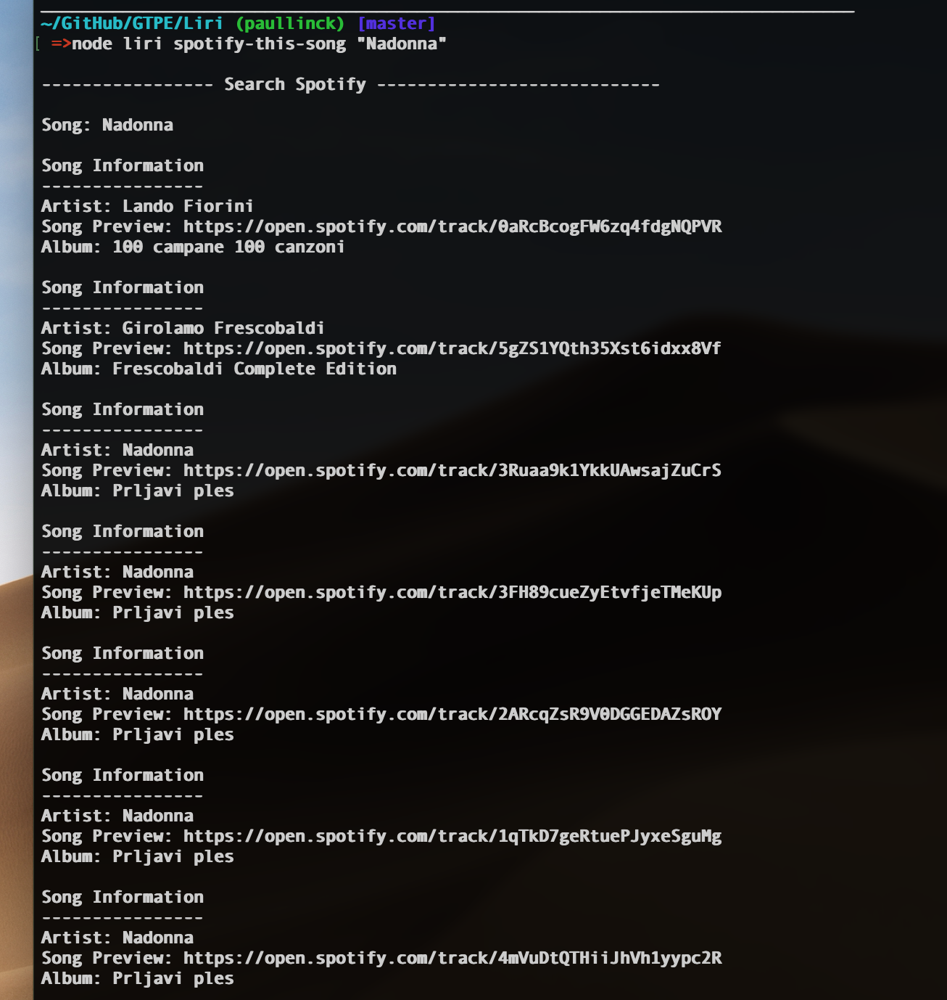
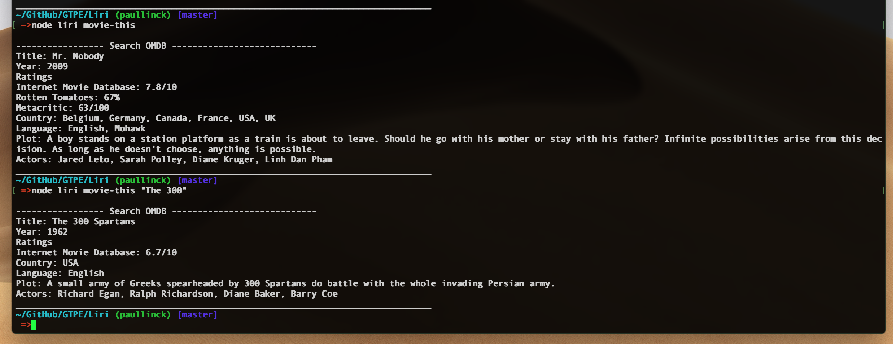
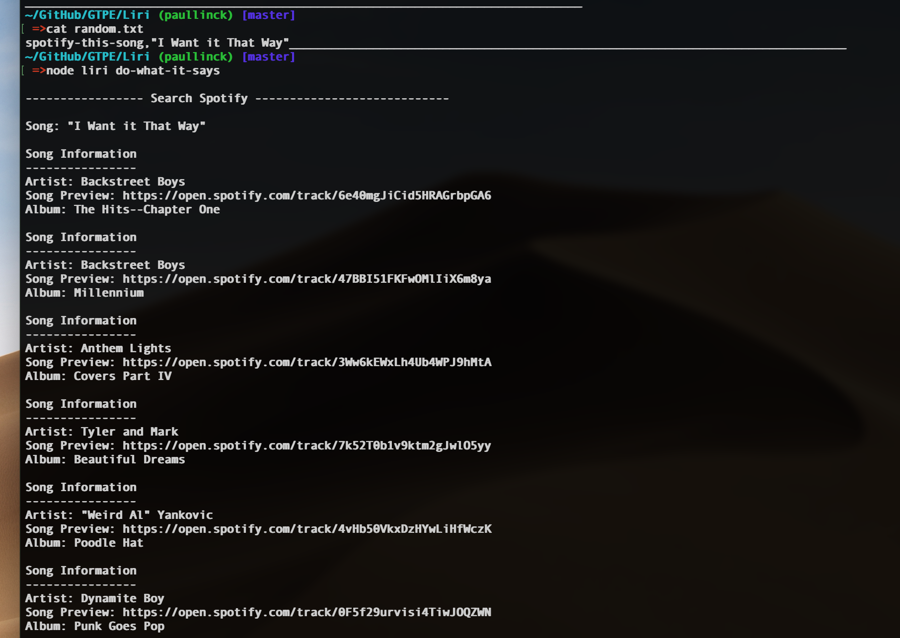
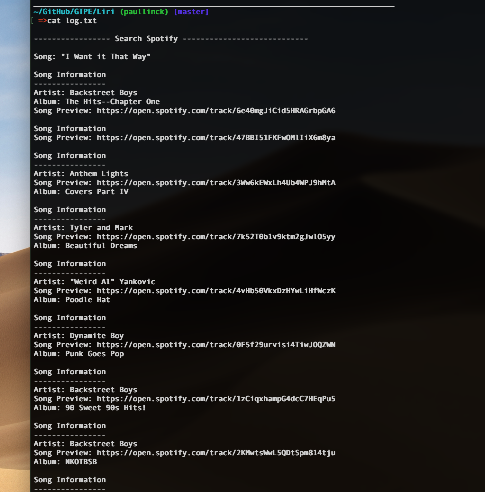

# LIRI

## Overview

This is LIRI. LIRI is like iPhone's SIRI. However, while SIRI is a Speech Interpretation and Recognition Interface, LIRI is a _Language_ Interpretation and Recognition Interface. LIRI is a command line node app that takes in parameters and gives you back data.

I also log all the output to a file called log.txt

### Links on GitHub

[Liri](https://github.com/plinck/Liri)
[My Portfolio](https://plinck.github.io/My-Portfolio/)

### Screen Shots








### Components

1. LIRI can search Spotify for songs, Bands in Town for concerts, and OMDB for movies.

2. To retrieve the data that will power this app, I use `axios` package to call Bands in Town, Spotify and OMDB APIs.

   * [Node-Spotify-API](https://www.npmjs.com/package/node-spotify-api)

   * [Axios](https://www.npmjs.com/package/axios)

     * I use Axios to grab data from the [OMDB API](http://www.omdbapi.com) and the [Bands In Town API](http://www.artists.bandsintown.com/bandsintown-api)

   * [Moment](https://www.npmjs.com/package/moment)

   * [DotEnv](https://www.npmjs.com/package/dotenv)

## GitHub

This is on a normal GitHub Repository, but not deployed as it is CLI app.

Because of this, I include screenshots, and animaited gifs showing the working app. These are in this README file.

* Includes screenshots of typical user flows through your application (for the customer and if relevant the manager/supervisor). This includes views of the prompts and the responses after their selection (for the different selection options).

* Includes other screenshots to help someone who has never been introduced to your application understand the purpose and function of it. This is how you will communicate to potential employers/other developers in the future what you built and why, and to show how it works.

* API keys are private since I keep the in .env local to the computer running the app

### Usage / Commands

1. `node liri.js ?`

   * Shows the list of available commands

2. `node liri.js concert-this <artist/band name here>`

   * Searched the Bands in Town Artist Events API (`"https://rest.bandsintown.com/artists/" + artist + "/events?app_id=codingbootcamp"`) for an artist and renders the following information about each event to the terminal:

     * Name of the venue

     * Venue location

     * Date of the Event (use moment to format this as "MM/DD/YYYY")

3. `node liri.js spotify-this-song '<song name here>'`

   * Shows the following information about the song in your terminal/bash window

     * Artist(s)

     * The song's name

     * A preview link of the song from Spotify

     * The album that the song is from

   * If no song is provided then it defaults to "The Sign" by Ace of Base.

   * Utilizes the [node-spotify-api](https://www.npmjs.com/package/node-spotify-api) package in order to retrieve song information from the Spotify API.

4. `node liri.js movie-this '<movie name here>'`

   * Outputs the following information to your terminal/bash window:

     ```
       * Title of the movie.
       * Year the movie came out.
       * IMDB Rating of the movie.
       * Rotten Tomatoes Rating of the movie.
       * Country where the movie was produced.
       * Language of the movie.
       * Plot of the movie.
       * Actors in the movie.
     ```

   * If the user doesn't type a movie in, it outputs data for the movie 'Mr. Nobody.'

   * I use the `axios` package to retrieve data from the OMDB API. The OMDB API requires an API key. You may use `trilogy`.

5. `node liri.js do-what-it-says`

   * Using the `fs` Node package, LIRI takes the text inside of random.txt and then uses it to call one of LIRI's commands.

     * It runs `spotify-this-song` for "I Want it That Way," since that is the text in `random.txt`.

     * Edit the text in random.txt to test out this feature for movie-this and concert-this.

### To Do
  
- - -